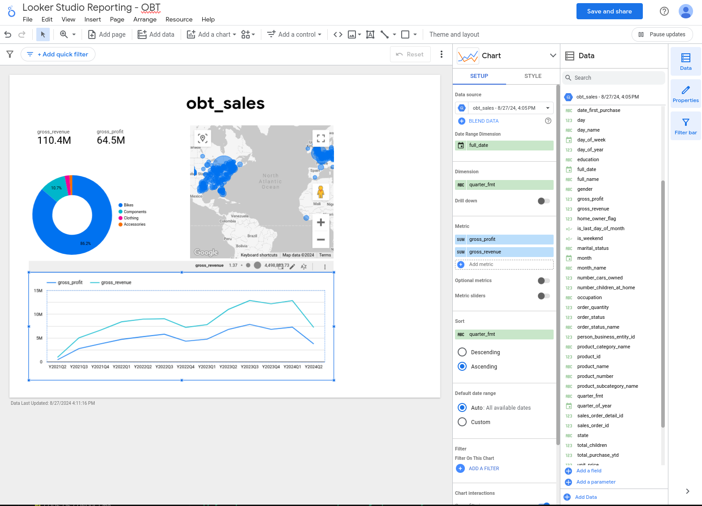

# Modernizing Classic Data Warehousing with BigQuery

## Introduction

## Coach's Guides

- Challenge 1: Loading the source data
- Challenge 2: Staging tables
- Challenge 3: Dataform for automation
- Challenge 4: Dimensional modeling
- Challenge 5: Business Intelligence
- Challenge 6: Notebooks for data scientists
- Challenge 7: Cloud Composer for orchestration
- Challenge 8: Monitoring the workflow

## Challenge 1: Loading the source data

### Notes & Guidance

Although most of this will be done through the UI by the participants, the following commands make it possible to run this challenge from the command line.

```shell
REGION=...
BQ_DATASET=raw
bq mk --location=$REGION -d $BQ_DATASET
```
  
Creating the BigLake connection:

```shell
CONN_ID=conn
bq mk --connection --location=$REGION --connection_type=CLOUD_RESOURCE $CONN_ID

SA_CONN=`bq show --connection --format=json $REGION.$CONN_ID | jq -r .cloudResource.serviceAccountId`

gcloud projects add-iam-policy-binding $GOOGLE_CLOUD_PROJECT --member="serviceAccount:$SA_CONN" \
    --role="roles/storage.objectViewer" --condition=None
```

Once the connection is created and has the proper permissions, you can then run the following SQL for the tables `person`, `sales_order_header` and `sales_order_detail` after updating the relevant bits.

```sql
CREATE OR REPLACE EXTERNAL TABLE raw.person
  WITH CONNECTION `$REGION.$CONN_ID`
  OPTIONS (
    format = "CSV",
    uris = ['gs://${PROJECT_ID}-landing/person/*.csv']
  );
```

## Challenge 2: Staging tables

### Notes & Guidance

```shell
BQ_DATASET=curated
bq mk --location=$REGION -d $BQ_DATASET
```

```sql
CREATE TABLE curated.stg_person AS
  SELECT DISTINCT * EXCEPT(hobby, comments)
  FROM raw.person
```

```sql
CREATE TABLE curated.stg_sales_order_header AS
  SELECT DISTINCT * EXCEPT(comment, order_date, ship_date, due_date), 
    DATE(order_date) AS order_date, 
    DATE(ship_date) AS ship_date,
    DATE(due_date) AS due_date 
  FROM raw.sales_order_header
```

```sql
CREATE TABLE curated.stg_sales_order_detail AS
  SELECT DISTINCT * 
  FROM raw.sales_order_detail
```

The table `person` has one duplicate record for `business_entity_id` with the value `11751`. You can verify that there are no duplicate records for this table by either checking the total number of rows (must be 19972) or by running the following query:

```sql
SELECT
  business_entity_id,
  COUNT(*) cnt
FROM
  `raw.person`
GROUP BY
  business_entity_id
HAVING
  cnt > 1
```

## Challenge 3: Dataform for automation

### Notes & Guidance

Configuring the Git connection should be trivial through the UI, it's a link `CONNECT WITH GIT` in the `SETTINGS` tab. In that settings tab you can also set the Google Cloud Project ID by editing `Workspace compilation overrides`.

Once the development workspace has been created, navigate to `workflow_settings.yaml` and click on `INSTALL PACKAGES` button to install the required packages. And then `START EXECUTION` and pick Tag _staging_. Don't forget to include the dependencies.

## Challenge 4: Dimensional modeling

### Notes & Guidance

```shell
BQ_DATASET=dwh
bq mk --location=$REGION -d $BQ_DATASET
```

```sql
config {
    type: "table",
    schema: "dwh",
    tags: ["fact"]
}

SELECT
  ${keys.surrogate("sod.sales_order_id", "sod.sales_order_detail_id")} AS sales_key,
  ${keys.surrogate("sod.product_id")} AS product_key,
  ${keys.surrogate("customer_id")} AS customer_key,
  ${keys.surrogate("credit_card_id")} AS credit_card_key,
  ${keys.surrogate("ship_to_address_id")} AS ship_address_key,
  ${keys.surrogate("status")} AS order_status_key,
  ${keys.surrogate("order_date")} AS order_date_key,
  -- sod.sales_order_id,
  -- sod.sales_order_detail_id,
  sod.unit_price,
  sod.unit_price_discount,
  p.standard_cost AS cost_of_goods_sold,
  sod.order_qty AS order_quantity,
  sod.order_qty * sod.unit_price AS gross_revenue,
  (sod.order_qty * sod.unit_price * (1 - sod.unit_price_discount)) - (p.standard_cost) AS gross_profit
FROM
  ${ref("stg_sales_order_detail")} sod,
  ${ref("stg_sales_order_header")} soh,
  ${ref("stg_product")} p
WHERE
  sod.sales_order_id = soh.sales_order_id
  AND sod.product_id = p.product_id
```

## Challenge 5: Business Intelligence

### Notes & Guidance

```sql
config {
    type: "table",
    schema: "dwh",
    tags: ["obt"]
}
SELECT
  a.* EXCEPT(address_key),
  d.* EXCEPT(date_key),
  p.* EXCEPT(product_key),
  cc.* EXCEPT(credit_card_key),
  o.* EXCEPT(order_status_key),
  c.* EXCEPT(customer_key),
  f.* EXCEPT(sales_key, customer_key, order_date_key, order_status_key, credit_card_key, ship_address_key, product_key)
FROM
  ${ref("fact_sales")} f,
  ${ref("dim_address")} a,
  ${ref("dim_date")} d,
  ${ref("dim_product")} p,
  ${ref("dim_credit_card")} cc,
  ${ref("dim_order_status")} o,
  ${ref("dim_customer")} c
WHERE
  f.product_key = p.product_key
  AND f.customer_key = c.customer_key
  AND f.credit_card_key = cc.credit_card_key
  AND f.order_status_key = o.order_status_key
  AND f.ship_address_key = a.address_key
  AND f.order_date_key = d.date_key
```

Create a new _calculated field_ in Looker Studio (through `Add a field`) using the following formula:

```sql
CONCAT("Y", year, "Q", quarter_of_year)
```

Most of the charts should be trivial, the last one might present some challenges, see below an example dashboard and the configuration for the final chart in the following screenshot:



## Challenge 6: Notebooks for data scientists

### Notes & Guidance

Afer uploading the notebook, connecting to a runtime and running the cells, the following snippet can be used to create the model:

```sql
CREATE OR REPLACE MODEL `dwh.churn_model`
OPTIONS
(
  model_type='LOGISTIC_REG',
  auto_class_weights=TRUE,
  input_label_cols=['churned']
) AS
SELECT * EXCEPT(customer_id) FROM exploration.churn_training
```

## Challenge 7: Cloud Composer for orchestration

### Notes & Guidance

You need to set the environment variable `DATAFORM_REPOSITORY_ID` to the repository name (not the development workspace) configured in Challenge 4.

## Challenge 8: 

### Notes & Guidance

This should be trivial as well, from the Monitoring tab of the Cloud Composer environment you can find the Failed DAG runs metric and create an alert from it by filling in the provided details.