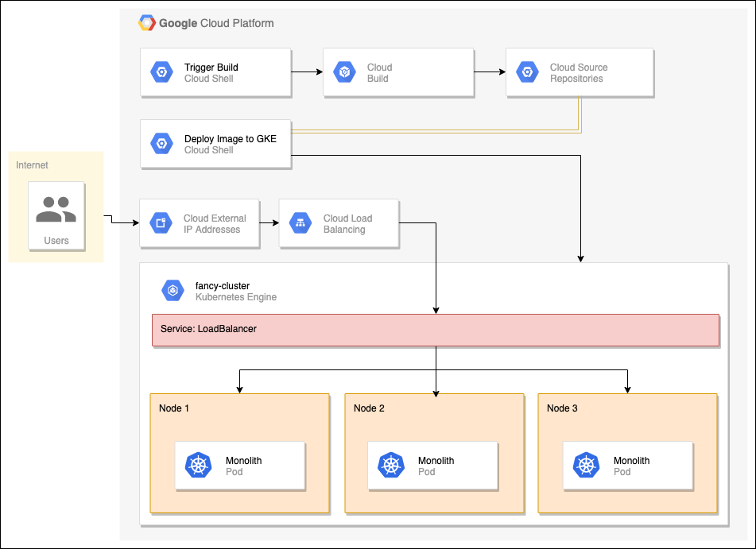

# Intro to GKE: Deploy, Scale and Update

## Introduction

Running websites and applications is hard.

Things go wrong when they shouldn't, servers crash, increase in demand causes more resources to be utilized, and making changes without downtime is complicated and stressful.

Imagine a tool that could help you do all that and even allow you to automate it! With GKE, all of that is not only possible, it's easy! In this gHack, you assume the role of a developer running an eCommerce website for a fictional company named Fancy Store. Due to problems with scaling and outages, you're tasked with deploying your application to GKE!

## Learning Objectives

In this gHack you will experience what a cloud developer needs to go through to successfully deploy an application. You will learn to:

- Create a GKE cluster.
- Create a Docker container.
- Deploy the container to GKE.
- Expose the container via a service.
- Scale the container to multiple replicas.
- Modify the application.
- Perform a zero downtime rolling update on Kubernetes

## Challenges

- Setting Up the Environment
   - Before we can hack, you will need to set up a few things.
   - Run the instructions on our [Environment Setup](../../faq/howto-setup-environment.md) page.
- Challenge 1: 
   - 
- Challenge 2: 
   - 
- Challenge 3: 
   - 
- Challenge 4: 
   - 

## Prerequisites

- A basic understanding of Docker and Kubernetes 
   - If you lack a basic understanding, you can review [Docker](https://docs.docker.com/) and [Kubernetes](https://kubernetes.io/docs/home/) now.

## Contributors

- Gino Filicetti

## Challenge 1: 

### Introduction (Optional)

When setting up an IoT device, it is important to understand how 'thingamajigs' work. Thingamajigs are a key part of every IoT device and ensure they are able to communicate properly with edge servers. Thingamajigs require IP addresses to be assigned to them by a server and thus must have unique MAC addresses. In this challenge, you will get hands on with a thingamajig and learn how one is configured.

### Description

In this challenge, you will properly configure the thingamajig for your IoT device so that it can communicate with the mother ship.

You can find a sample `thingamajig.config` file in the Files section of this hack's Google Space provided by your coach. This is a good starting reference, but you will need to discover how to set exact settings.

Please configure the thingamajig with the following specifications:
- Use dynamic IP addresses
- Only trust the following whitelisted servers: "mothership", "IoTQueenBee" 
- Deny access to "IoTProxyShip"

### Success Criteria

- Verify that the IoT device boots properly after its thingamajig is configured.
- Verify that the thingamajig can connect to the mothership.
- Demonstrate that the thingamajig will not connect to the IoTProxyShip

### Learning Resources

- [What is a Thingamajig?](https://www.google.com/search?q=what+is+a+thingamajig)
- [10 Tips for Never Forgetting Your Thingamajig](https://www.youtube.com/watch?v=dQw4w9WgXcQ)
- [IoT & Thingamajigs: Together Forever](https://www.youtube.com/watch?v=yPYZpwSpKmA)

### Tips

- IoTDevices can fail from a broken heart if they are not together with their thingamajig. Your device will display a broken heart emoji on its screen if this happens.
- An IoTDevice can have one or more thingamajigs attached which allow them to connect to multiple networks.