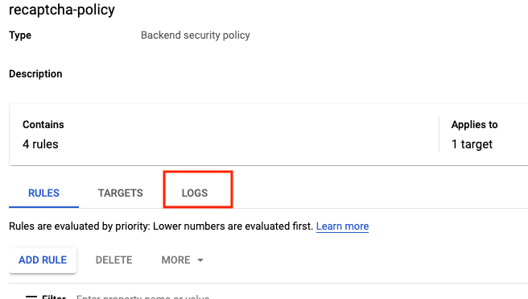
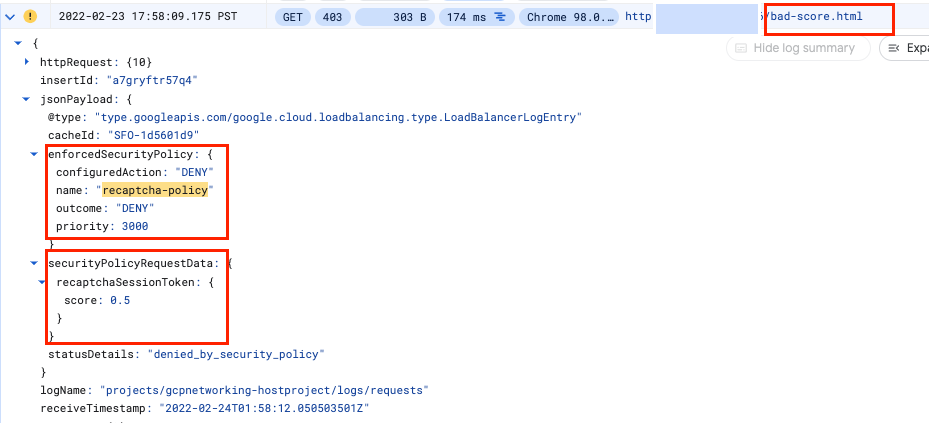

# Challenge 4 - Configure Bot Management

[< Previous Challenge](./Challenge-03.md) - **[Home](../README.md)**

## Description

### Create Cloud Armor security policy rules for Bot Management
In this section, you will use Cloud Armor bot management rules to allow, deny and redirect requests based on the reCAPTCHA score. Remember that when you created the session token site key, you set a testing score of 0.5.

1. In Cloud Shell, create security policy via gcloud:

    ```bash
    gcloud compute security-policies create recaptcha-policy \
        --description "policy for bot management"
    ```
1. To use reCAPTCHA Enterprise manual challenge to distinguish between human and automated clients, associate the reCAPTCHA WAF challenge site key we created for manual challenge with the security policy. Replace "CHALLENGE-PAGE-KEY" with the key we created:

    ```bash
    gcloud compute security-policies update recaptcha-policy \
        --recaptcha-redirect-site-key "CHALLENGE-PAGE-KEY"
    ```

1. Add a bot management rule to allow traffic if the url path matches good-score.html and has a score greater than 0.4:

    ```bash
    gcloud compute security-policies rules create 2000 \
        --security-policy recaptcha-policy \
        --expression "request.path.matches('good-score.html') &&    token.recaptcha_session.score > 0.4" \
        --action allow
    ```

1. Add a bot management rule to deny traffic if the url path matches bad-score.html and has a score less than 0.6: 

    ```bash
    gcloud compute security-policies rules create 3000 \
        --security-policy recaptcha-policy \
        --expression "request.path.matches('bad-score.html') && token.recaptcha_session.score < 0.6" \
        --action "deny-403"
    ```

1. Add a bot management rule to redirect traffic to Google reCAPTCHA if the url path matches median-score.html and has a score equal to 0.5:

    ```bash
    gcloud compute security-policies rules create 1000 \
        --security-policy recaptcha-policy \
        --expression "request.path.matches('median-score.html') && token.recaptcha_session.score == 0.5" \
        --action redirect \
        --redirect-type google-recaptcha
    ```

1. Attach the security policy to the backend service http-backend:

    ```bash
    gcloud compute backend-services update http-backend \
        --security-policy recaptcha-policy –-global
    ```

1. In the Console, navigate to **Navigation menu > Network Security > Cloud Armor**.

1. Click **recaptcha-policy**. Your policy should resemble the following:

    

### Validate Bot Management with Cloud Armor

1. Open up a browser and enter the url ***http://[LB_IP_v4]/index.html***. Navigate to **"Visit allow link"**. You should be allowed through:

    

1. Open a new window in Incognito mode to ensure we have a new session. Enter the url ***http://[LB_IP_v4]/index.html*** and navigate to **"Visit blocked link"**. You should receive a HTTP 403 error

    

1. Open a new window in Incognito mode to ensure we have a new session. Enter the url ***http://[LB_IP_v4]/index.html*** and navigate to **"Visit redirect link"**. You should see the redirection to Google reCAPTCHA and the manual challenge page as below

    

### Verify Cloud Armor logs

Explore the security policy logs to validate bot management worked as expected.

1. In the Console, navigate to **Navigation menu > Network Security > Cloud Armor**.

1. Click **recaptcha-policy**

1. Click **Logs**

    

1. Click **View policy logs**

1. Below is the MQL(monitoring query language) query, you can copy and paste into the query editor: 

    ```sql
    resource.type:(http_load_balancer) AND jsonPayload.enforcedSecurityPolicy.name:(recaptcha-policy)
    ```

1. Now click Run Query.

1. Look for a log entry in Query results where the request is for ***http://[LB_IP_v4]/good-score.html***. Expand jsonPayload. Expand enforcedSecurityPolicy.

    

1. Repeat the same for ***http://[LB_IP_v4]/bad-score.html*** and ***http://[LB_IP_v4]/median-score.html***

    

    

Notice that the configuredAction is set to **ALLOW, DENY or GOOGLE_RECAPTCHA** with the name **recaptcha-policy**.

> Cloud Armor security policies create logs that can be explored to determine when traffic is denied and when it is allowed, along with the source of the traffic.

## Success Criteria

- You've configured the Cloud Armor security policy rules for Bot Management 
- The policy has been attached to the backend 
- Users with a good score are allowed through 
- Users with a median score are redirected to the reCAPTCHA manual challenge 
- Users with a bad score are not allowed through 
- A score is recorded in the Cloud Armor logs when a user attempts to access the landing page links 

## Learning Resources

- [Overview of reCAPTCHA Enterprise for WAF and Google Cloud Armor integration](https://cloud.google.com/recaptcha-enterprise/docs/integration-overview)
- [Implement the reCAPTCHA Enterprise for WAF and Google Cloud Armor integration](https://cloud.google.com/recaptcha-enterprise/docs/implement-tokens)
- [Google Cloud Armor bot management overview](https://cloud.google.com/armor/docs/bot-management)
- [Configure Google Cloud Armor security policies](https://cloud.google.com/armor/docs/configure-security-policies#bot-management)

## Tips (Optional)

- Optional tips go here
- Don't give away
- Too much
